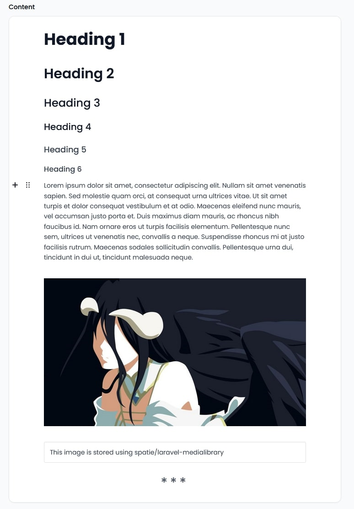

# Filament EditorJS

[](https://packagist.org/packages/athphane/filament-editorjs)
[](https://github.com/athphane/filament-editorjs/actions?query=workflow%3Arun-tests+branch%3Amain)
[](https://github.com/athphane/filament-editorjs/actions?query=workflow%3A"Fix+PHP+code+styling"+branch%3Amain)
[](https://packagist.org/packages/athphane/filament-editorjs)

An EditorJS field for Filament, with support for image uploads using Spatie's Media Library package.



## Installation

You can install the package via composer:

```bash
composer require athphane/filament-editorjs
```

You can publish the config file with:

```bash
php artisan vendor:publish --tag="filament-editorjs-config"
```

Optionally, you can publish the views using

```bash
php artisan vendor:publish --tag="filament-editorjs-views"
```

This is the contents of the published config file:

```php
return [
    /**
     * The profiles to use for the editorjs field.
     * The default profile is the default_profile from the config.
     */
    'profiles' => [
        'default' => [
            'header', 'image', 'delimiter', 'list', 'underline', 'quote', 'table',
        ],
        'pro' => [
            'header', 'image', 'delimiter', 'list', 'underline', 'quote', 'table',
            'raw', 'code', 'inline-code', 'style',
        ],
    ],

    /**
     * The default profile to use for the editorjs field.
     */
    'default_profile' => 'default',

    /**
     * The allowed image mime types for the editorjs field.
     */
    'image_mime_types' => [
        'image/jpeg',
        'image/png',
        'image/gif',
        'image/tiff',
        'image/x-citrix-png',
        'image/x-png',
        'image/svg+xml',
        'image/svg',
    ],
];
```

## Usage
This package requires you to do some initial setup before you can use it. 

This package uses EditorJS and integrates the Image Upload Plugin with Spatie's Media Library package. For this reason,
you will need to set up your models to use the Media Library package.

### Setting up models

First of all, you need somewhere to store the content for the editorjs field itself. This package assumes that you will
have a NULLABLE `content` column of type json in your database table. This column will be used to store the content for the editorjs field.

Your model must implement the `Spatie\MediaLibrary\HasMedia` interface, and use the `Spatie\MediaLibrary\InteractsWithMedia` trait.

Next, you must use this package's `Athphane\FilamentEditorjs\Traits\ModelHasEditorJsComponent` trait in your model. This
trait offers a couple of methods to help you set up your model to work with the editorjs field.

#### Changing the default column name for the content field
The package assumes that you will use a column named `content` to store the content. If you want to use a different column name, 
you can go ahead and change the column name. Then on your model, you must override the `editorJsContentFieldName` method to return 
the new name of the column.

```php
/**
 * The name of the field that contains the content for the editorjs field
 */
public function editorJsContentFieldName(): string
{
    return 'new_column_name';
}
```

#### Registering the media collections and conversions
As this packages main aim is to integrate with Spatie's Media Library package, you will need to register the media collections
for the editorjs media collection. Normally, you would do this in your model's own `registerMediaCollections` and `registerMediaConversions` methods.
However, this package offers a convenience method to do that for you.

The `ModelHasEditorJsComponent` trait offers the methods `registerEditorJsMediaCollections` and `registerEditorjsMediaConversions`. 
This method can be used in the `registerMediaCollection` and `registerMediaConversions` method of your own model as follows:

```php
public function registerMediaCollections(): void
{
    $this->registerEditorJsMediaCollections();
}

public function registerMediaConversions(?Media $media = null): void
{
    $this->registerEditorJsMediaConversions($media);
}
```

#### Settings up allowed mime types for the editorjs media collection
By default, the package will allow a set of mime types defined in the config file of the package. 
You can change this by updating the config file values, or by programmatically setting the mime types on the `registerEditorJsMediaCollections`

```php
public function registerMediaCollections(): void
{
    $this->registerEditorJsMediaCollections(mime_types: [
        'image/jpeg',
        'image/png',
        'image/gif',
        'image/tiff',
        'image/x-citrix-png',
        'image/x-png',
        'image/svg+xml',
        'image/svg',
    ]);
}
````

#### Enabling/Disabling the responsive images generation
By default, the package will generate responsive images for the editorjs media collection. 
You can disable this by passing `false` on the $generate_responsive_images argument to the `registerEditorJsMediaCollections` method.

```php
public function registerMediaCollections(): void
{
    $this->registerEditorJsMediaCollections(generate_responsive_images: false);
}
```

#### Modifying the default media collection name
By default, the package will use the `content_images` media collection name. 
You can change this by overriding the `editorjsMediaCollectionName` method.

```php
/**
 * The name of the media collection for the editorjs media collection
 */
public function editorjsMediaCollectionName(): string
{
    return 'new_media_collection_name';
}
```

### Setting up the editorjs field

Now that you have set up your model to work with the editorjs field, you can set up the editorjs field itself.

This package provides a `EditorjsTextField` component. You can use that directly in your form definition like this:
```php
public static function form(Form $form): Form
{
    return $form
        ->schema([
            EditorjsTextField::make('content')
                ->placeholder('Start writing...'),
        ]);
}
```

#### Configuring axios to successfully upload images
This package comes with some javascript code that will upload the image to the server. 
Usually you would have something like this in your `boostrap.js` file:

```js
import axios from 'axios';

window.axios = axios;

window.axios.defaults.headers.common['X-Requested-With'] = 'XMLHttpRequest';
```

This piece of javascript code, as far as I know, allows frontend code to upload files to the Laravel backend. 
Something to do with CSRF protection.

Because of this, you will need to define the following Filament Render hook in your application's `AppServiceProvider`;

```php
FilamentView::registerRenderHook(
    PanelsRenderHook::HEAD_END,
    fn(): string => Blade::render('@vite(\'resources/js/app.js\')'),
);
```

> This also assumes that you have set up your project's vite configuration correctly.

> We're using the app.js file cause the bootstrap.js file is simply included in the app.js file. 

## Testing

```bash
composer test
```

## Changelog

Please see [CHANGELOG](CHANGELOG.md) for more information on what has changed recently.

## Contributing

Please see [CONTRIBUTING](.github/CONTRIBUTING.md) for details.

## Security Vulnerabilities

Please review [our security policy](../../security/policy) on how to report security vulnerabilities.

## Credits

- [athphane](https://github.com/athphane)
- [All Contributors](../../contributors)

## License

The MIT License (MIT). Please see [License File](LICENSE.md) for more information.
